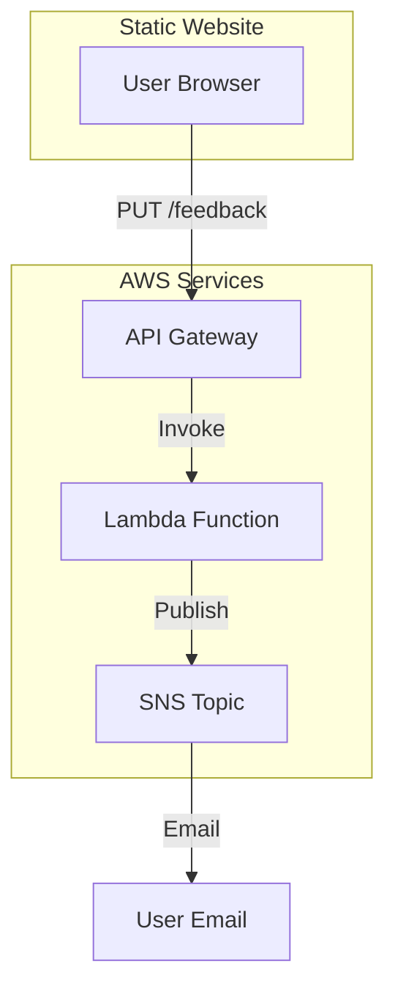

# Architecture & Workflow Diagram

## High-Level Workflow

## Detailed Steps
1. User fills form on S3-hosted website
2. Form submits to API Gateway (PUT method)
3. API Gateway triggers Lambda
4. Lambda publishes message to SNS
5. SNS sends email notification

## Components
- **Frontend**: S3 Static Hosting
- **Backend**: API Gateway + Lambda (Python)
- **Notification**: SNS
